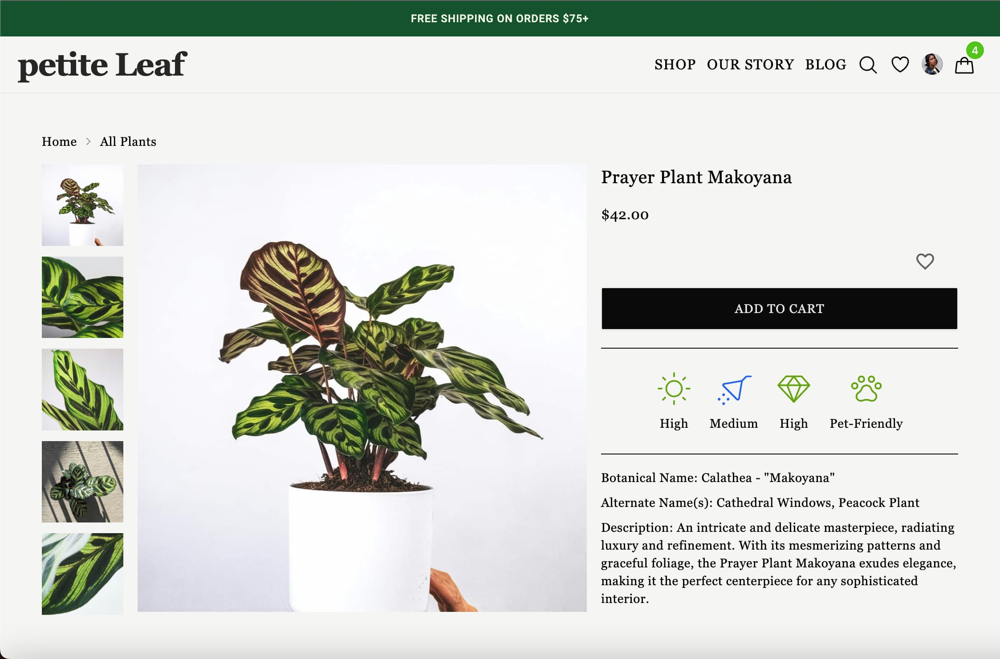

<h1><em>petite leaf </em>🌿</h1>

## Table Of Contents

- [Overview](#overview)
- [Sneak Peak](#sneak-peak)
- [Tech Stack](#tech-stack)
  - [Frontend](#frontend)
  - [Backend](#backend)
  - [Style](#style)

## Overview

<a href="https://petite-leaf.vercel.app/">Petite Leaf</a> is a botanical e-commerce application created by a house plant lover for house plant lovers. Bring a touch of nature into your home. Users can browse, search and shop their favorite indoor foliage. Filter plants by water, light and care needs as well as by pet-safety status to find the perfect plants for your home. Users can also sign up for a petite leaf <a href="https://petite-leaf.vercel.app/register">account</a> to keep track of plant favorites and previous orders. To learn how to care for different plants, users can delve into the <a href="https://petite-leaf.vercel.app/blog">Bontanical Journal</a> blog for all things plants.

## Sneak Peak

## Tech Stack

### Frontend

- JavaScript
- React
- React Router
- Redux / Redux Toolkit
- React Query

### Backend

- Supabase (Postgres Database, Storage & API)

### Style

- TailwindCSS
- DaisyUI
- Material UI
- Ant Deisgn
